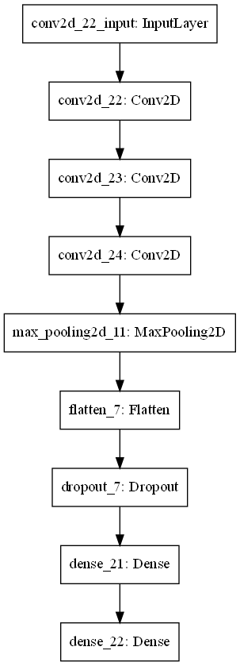

# coronahack_chest_x-ray

Data originally taken from https://www.kaggle.com/praveengovi/coronahack-chest-xraydataset taken on October 10, 2021

In this repository, I analyze X-ray images to identify COVID-19 patients.
This is an inherently a silly task since someone who has pneumonia is clearly is
in distress and requires medical attention. However, what I find as an interesting
problem is the categorizing between COVID-19 and other diseases.

## Model #1: Healthy or Not

This is a broad categorization model to distinguish between normal and
pneumonia patients. If we have identified that the patient has pneumonia,
we will feed those results to a second classifier model.

With just three epochs, my model has a validation accuracy of ~75%. The model
is below.

## Model #2: Specific Disease Classification
This model will try to distinguish between COVID-19, bacteria, or other. 